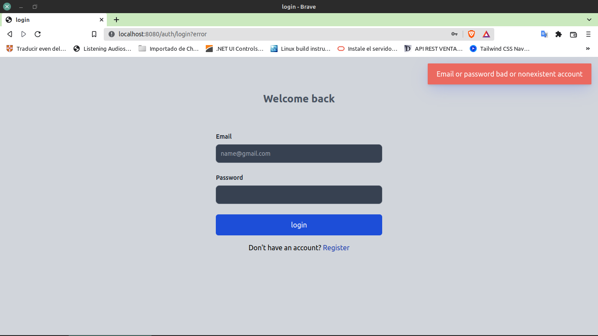
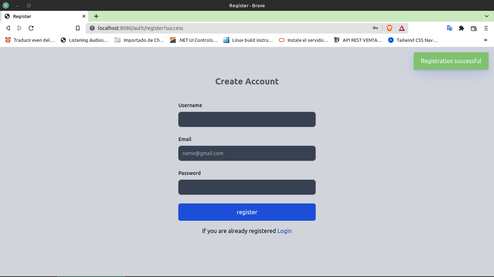
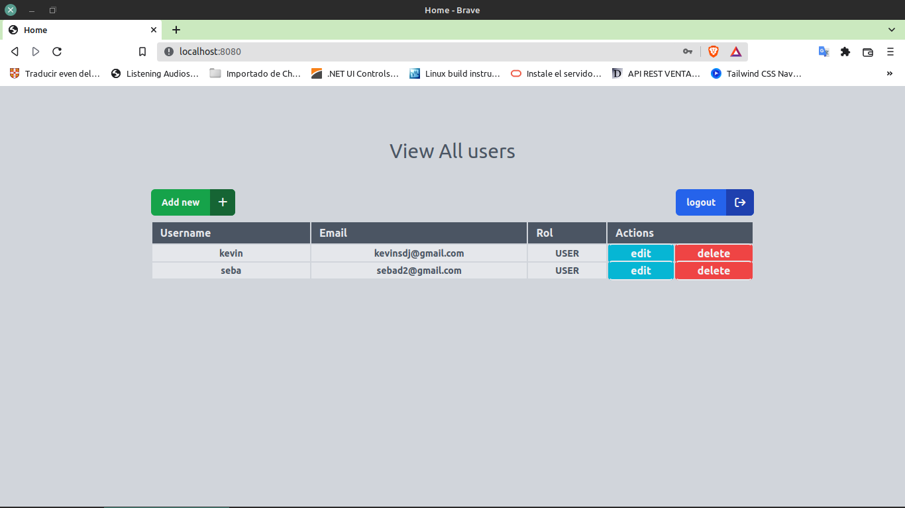

# SPRING-BOOT USER CRUD + SPRING-SECURITY

This app is already uploaded in an image to my docker hub

#### practice application with spring-boot and spring-security
* thymeleaft
* tailwindcss
* toastify-js
* postgreSQL

#### if you want to try the application
1. Clone the repository
2. Make sure you have docker and docker-compose installed on your computer

***
### run docker compose on the cloned project folder at the same level as the dockerfile

- `docker-compose up -d`

### to stop the execution, delete the containers and images

- `docker-compose down --rmi all -v`
~~~
 port execution : 3000
~~~

~~~
Good bye 😊 ✋